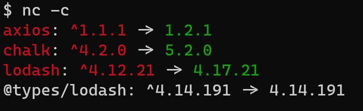
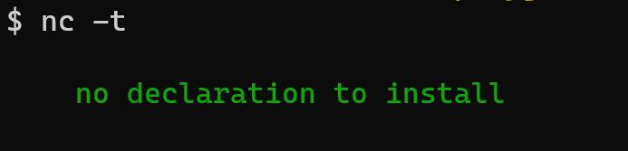
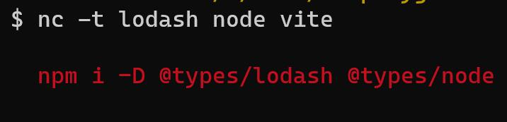
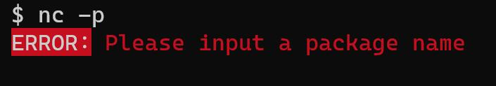
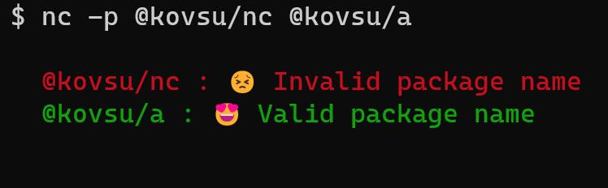

## nc

### Usage

```bash
npm i @kovsun/nc -g
```

### nc -c

View the latest version of dependencies in package.json.



### nc -t

Check whether the dependencies in package.json require type declarations.




### nc -p pkg-name

Check whether the package name already exists in npm.





